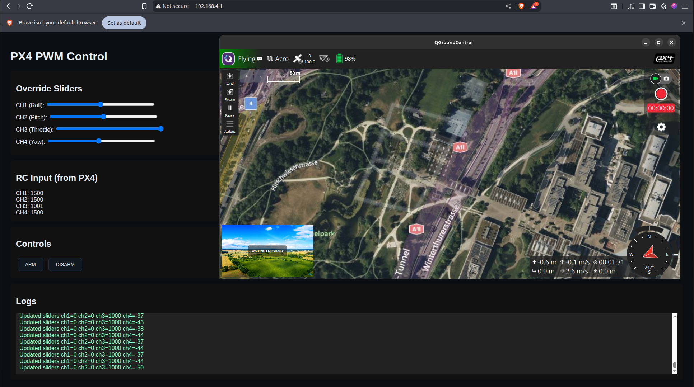

# PX4 ESP32 Arm-the-Drone

This project demonstrates how to arm, disarm, and control a PX4-based flight controller using an ESP32. The ESP32 runs a WiFi access point, hosts a local web-based UI, transmits MANUAL_CONTROL MAVLink messages, receives RC telemetry, and sends arming/disarming commands.

---

## 📌 Features

* **Web-based UI** served directly from the ESP32
* **ARM / DISARM** the drone via on-screen buttons
* **Real-time RC telemetry** (CH1–CH4) from PX4
* **PWM override sliders** (Roll, Pitch, Throttle, Yaw)
* **Continuous MANUAL_CONTROL MAVLink streaming**
* **Async WebSocket communication** for efficient updates
* **PX4 connection via TELEM3** using MAVLink 2.0

---

## 🛠 Hardware Setup

### Required Components

* ESP32 DevKit (mhetesp32devkit or equivalent)
* PX4 flight controller (validated on Pixhawk 6X)
* UART connection from ESP32 → TELEM3 port

### Wiring

| PX4 TELEM3 | ESP32        |
| ---------- | ------------ |
| TX         | GPIO 16 (RX) |
| RX         | GPIO 17 (TX) |
| GND        | GND          |

### Baud Rate

The system operates at **921600 baud**, matching PX4 TELEM3 default high-speed telemetry configuration.

---


## 🧩 Software Setup

### PlatformIO `platformio.ini`

This project uses:

* MAVLink v2 C Library
* ArduinoJson
* AsyncTCP
* AsyncWebServer

All required configurations are already included in the provided `platformio.ini`.

Copy the included settings into your PlatformIO environment to ensure correct compilation.

---

## 🚀 Usage Instructions

### 1. Flash the ESP32

Upload the firmware to your ESP32 using PlatformIO.

### 2. Connect to WiFi

After boot, ESP32 creates an AP:

* **SSID:** `PX4-ESP32-PWM`
* **Password:** `px4esp32pwm`

Open browser and navigate to:

```
http://192.168.4.1
```

### 3. Using the Control UI

#### **Override Sliders**

* Send manual Roll, Pitch, Throttle, and Yaw commands.
* Values transmit instantly via MANUAL_CONTROL messages.

#### **RC Input Display**

* Shows real-time RC telemetry as received from PX4.

#### **Arming Controls**

* Press **ARM** to arm the drone.
* Press **DISARM** to disarm.

Arming functions through MAV_CMD_COMPONENT_ARM_DISARM commands.

#### **Logs Panel**

* Displays events, slider updates, and command acknowledgements.

---




## 📡 MAVLink Behavior

### Sent by ESP32

* `MANUAL_CONTROL` messages (100 ms interval)
* `COMMAND_LONG` for arm/disarm

### Received from PX4

* `RC_CHANNELS` (decoded and placed in telemetry JSON)

---

## 🧪 Confirmed Working

* PX4 accepts arm/disarm commands
* Web UI updates in real-time
* Manual control overrides work : Modes : Stabilized, Acro, Altitude
* Telemetry properly displayed
* Esp32 can arm the drone without RC signal

---

## 📁 Repository Structure

```
Px4_esp32-Arm-the_Drone/
├── src/
│   └── main.cpp
├── include/
├── platformio.ini
└── README.md
```

---

## ⚠️ Safety Reminder

* Only test with **Propellers disconnected** or drone secured.
* Arming should always be done in a controlled environment.

---

## 📄 License


---

## 👤 Dasig John Paul

Project created and maintained by **b3kL0g2010**.

ESP32 controlled PX4 arming successfully implemented using this codebase.
